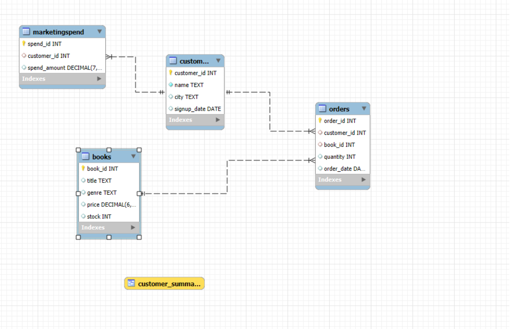
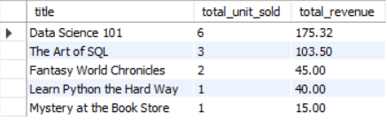
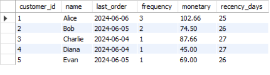
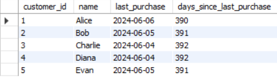
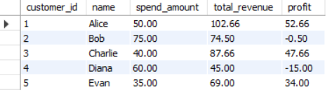

# Bookstore Database Analytics System

## Overview
This project is a SQL-based bookstore analytics system designed to manage and analyze bookstore operations using relational database concepts and business analytics queries.

The project focuses on:
- Database schema design
- Relational modeling
- Business KPI analysis
- Customer analytics
- Revenue analysis
- Marketing ROI analysis

---

## Technologies Used
- MySQL
- SQL

---

## Database Design
The database contains the following tables:
- Books
- Customers
- Orders
- MarketingSpend

Relationships are established using foreign keys to maintain data integrity.

--- 

## Database Schema

---

## Features
- Book inventory management
- Customer order tracking
- Revenue analysis
- Customer segmentation
- Marketing performance analysis
- Churn analysis
- Sales trend analysis

---

## SQL Concepts Used
- Joins
- GROUP BY
- HAVING
- Aggregate Functions
- Common Table Expressions (CTEs)
- Window Functions
- Foreign Keys
- Views

---

## Analytical Queries Implemented

### Revenue Analysis
- Total revenue per book
- Monthly sales trend
- Average order value

## Revenue Analysis

The following analysis identifies top-performing books and customers based on revenue generation.

### Inventory Analysis
- Low stock alerts

### Customer Analytics
- RFM customer segmentation
- Returning customer analysis
- Customer churn analysis

## Customer Segmentation

RFM analysis was used to segment customers based on purchasing behavior.

## Customer Churn Analysis

Customer churn analysis was performed to identify inactive customers and understand customer retention patterns.

### Marketing Analytics
- Marketing ROI analysis

## Marketing ROI Analysis

Marketing ROI analysis was conducted to evaluate the effectiveness of marketing campaigns by comparing generated revenue against marketing expenditure.

---

## Key Insights
- Education and Technology books generated the highest revenue.
- Returning customers contributed significantly more revenue than one-time buyers.
- Certain books showed low stock levels, indicating restocking requirements.
- Marketing campaigns generated positive ROI for multiple customer segments.
- Some customers showed churn behavior based on inactivity analysis.

---

## Sample SQL Features
- Multi-table joins
- CTE-based analytics
- Window function ranking
- Revenue calculations
- Date-based analysis

---

## Future Improvements
- Add stored procedures and triggers
- Build a Power BI dashboard for bookstore analytics
- Integrate recommendation system logic
- Add customer loyalty analysis

---

## Conclusion
This project demonstrates practical SQL skills including relational database design, analytical querying, KPI generation, and business-oriented data analysis using MySQL.
